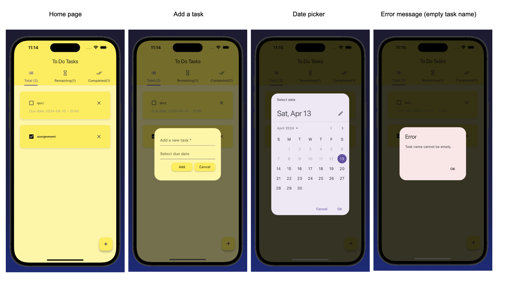
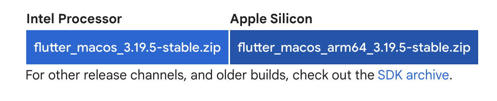
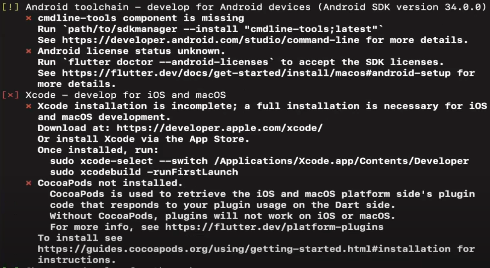
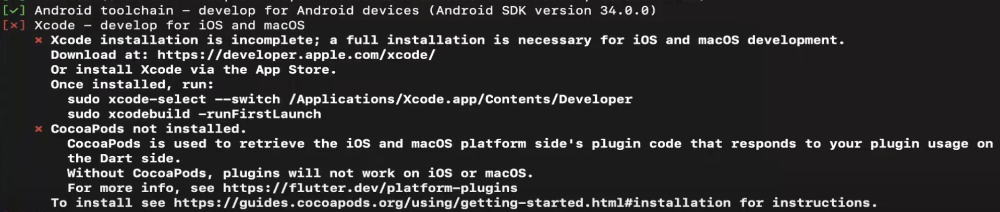
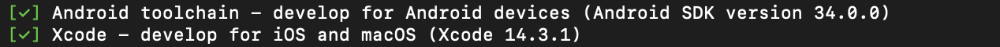

# Todo List Application

## Introdution
This project is a To Do List mobile application developed using Flutter, enabling it to run on both Android and iOS devices. Parts of the project were constructed by following a tutorial by Mitch Koko on YouTube, which can be accessed [here](https://www.youtube.com/watch?v=HQ_ytw58tC4).

The To Do List mobile app aims to provide users with ease of use with a simplistic user interface. It allowing users to...
* Add a task by entering a task name (compulsory) and a due date. An error dialog will be displayed if the task name field is left empty
* Tasks can be categorized and filtered into "Total," "Remaining," and "Completed" categories using the tab bar
* Display number of tasks within each filter
* Can mark a task as complete using a checkbox
* Can delete a task



## What is Flutter
Before diving into the specifics of the To Do List project, it's important to understand what Flutter is. Flutter is an open-source framework by Google that uses the Dart programming language. It may be put simply that Flutter is a toolkit for building applications, it offers fundamental components called widgets that can be customize and combine to create a unique user interface. These widgets include elements such as buttons, icons, and text.

Flutter allows the application to run more efficiently and with better performance. Also, it makes it convient to build a multi-platform application. This is because Flutter can build natively compiled application, which means that the app is written and compiled specifically for target operating system of a device like Android or iOS. Also, it can build multi-platform applications from a single codebase, which means the developers can build the app once and deploy it on various devices regardless of their operating system. You can view the [Flutter official website](https://flutter.dev/) for details.


## Getting Started
Before you can launch the To Do List mobile application, you will need to install below tools...
* Flutter
* Android Studio (to use the Andriod simulator)
* Xcode (to use the iOS simulator)
* An IDE such as Visual Studio Code (not compulsory but an IDE with Flutter extension is recommended)

### Install Flutter
Follow along with the [Flutter](https://docs.flutter.dev/get-started/install) installation website to install Flutter, below also shows a details in how to set it up with **macOS M1**

1. Open terminal and run the following code to install dependencies: 
```
sudo softwareupdate --install-rosetta --agree-to-license
```
2. Install the Flutter SDK
    1. Download the zip file from [Flutter](https://docs.flutter.dev/get-started/install/macos/mobile-ios?tab=download). It should be donwloaded into the `~/Downloads/` directory as default
    
    2. Run the code below in terminal to create a new folder under your home directory and goes into the directory. Flutter has suggested to create a directory at `~/development/`
        ```
        mkdir <path-name>
        cd <path-name>
        ```
    3. Run the code below in terminal to extract the zip file into the created folder
        ```
        unzip ~/Downloads/flutter_macos_arm64_3.19.5-stable.zip
        ```
    4. Add Flutter to your path: Either in the zshrc file for zsh terminal (run `vim .zshrc` to open it) or in the bash_profile file for bash terminal (run `vim .bash_profile` to open it). Add the code below
        ```
        export PATH="$PATH:<path-name>/flutter/bin"
        ```

If you run `flutter doctor` command in terminal, you will see that the status of all the tools. At this stage there should be error for Android Studio and Xcode as shown below. To elimiate the error, we need to install them...


### Install Android Studio
1. Install [Android Studio](https://developer.android.com/studio)
2. Open Android Studio :arrow_right: go to `Plugins` :arrow_right: search "Flutter" :arrow_right: cick `Install` (also install Dart) 
3. Go to `More Actions` :arrow_right: select `SDK Manager` :arrow_right: navigate to `Android SDK` :arrow_right: select `SDK Tools` option :arrow_right: install `Android SDK Command-line tools (latest)`
4. Run `flutter doctor --android-licenses` to accept the licences

If you run `flutter doctor`command again and sees green tick next to Android Studio as shown below then you can move on to install Xcode. If you still encounter error, try to look into the Issues to see if it could help.


> [!NOTE] 
> If you faces an issue with Flutter does not find Android SDK when setting up Android Studio. Try navigating into Android studio :arrow_right: click `More Actions` :arrow_right: click `SDK Manager` :arrow_right: go into `Android SDK` and copy your Android SDK Location (something like `/Users/name/Library/Android/sdk`) :arrow_right: paste below command into your terminal (remember to replace \<path-to-your-android-sdk-path> to your Android SDK location)
> ```
> flutter config --android-sdk "<path-to-your-android-sdk-path>"
> ```

### Install Xcode
1. Install [Xcode](https://developer.apple.com/xcode/resources/)
2. Open Xcode :arrow_right: select `Settings` :arrow_right: select `location` tab :arrow_right: select version of Xcode in the `Command Line Tools` selector
3. Install cocoapods 
    ```
    sudo gem install cocoapods
    ```
Run `flutter doctor`, if everything shows in green like below, then your're all set!


### Using Visual Studio Code (not needed but recommended)
1. Install [Visual Studio Code](https://code.visualstudio.com/download)
2. Open Visual Studio Code and install Flutter extension: click on `Extensions` tab :arrow_right: search for "Flutter" :arrow_right: click on `install`
> [!TIP]
> For your interest, if you want to create a Flutter project, you can use either the terminal or the command palette of Visual Studio Code...
> * **Terminal:** Run `flutter crate <project-name>` to create a flutter app :arrow_right: your app has been crated!
> * **Command palette of VS Code:** Press `Command + Shift + p` :arrow_right: type "flutter:" :arrow_right: click on `New Project` option :arrow_right: select the `Application` template :arrow_right: choose the location where you want to save your project :arrow_right: give a project name :arrow_right: your app has been created!


## How to launch the To Do List mobile application
After the set up has been completed, follow the steps below to run the To Do List Mobile application on your desired simulator...
1. Clone the project
    ```
    git clone https://github.com/UOA-CS732-SE750-Students-2024/cs732-assignment-swu628.git
    ```
2. Can use either the terminal or the Visual Studio Code to launch the project...
    * **Terminal**
        1. Launch either the iOS simulator `open -a Simulator` or the Andriod simulator (open Android Studio :arrow_right: click on `More Actions` :arrow_right: select `Virtual Device Manager` :arrow_right: then select the device)
        2. Go into the application directory `cd cs732-assignment-swu628`
        3. Run the Flutter app `flutter run`
    * **VS Code**
        1. Open the cloned project
        2. Select emluator: Press `Cmd+Shift+P` on keyboard for macOS or press `Ctrl+Shift+P` for Windows :arrow_right: choose `Flutter: Launch Emulator` :arrow_right: then choose either the iOS or the Andriod emulator
        3. Launch the application by click on `Run` :arrow_right: then click `Run Without Debugging`

After complete the steps above, you should be able to start adding a task!


## Functions explaining
The app leverages the Hive package for local data storage. It's structured across several files and classes, with each part handling specific functionalities within the app. Here's an overview of the functions and classes within the project:


### `main.dart`

The `main()` function inside the `main.dart` file is where the Flutter apps get started. It calls the runApp() method to run the app with the `MyApp` widget. Within `MyApp`, you can nest and arrange widgets to adjust the UI as you want.⁤⁤ 

As a part of my implementation, the Hive database is used in order to store the local data, this step is not mandatory and can be skipped if your application does not need data storage. The `MyApp` widget first return the `MaterialApp` widget, which is a material library that consists of commonly-used widgets for Material Design application. Finally, the `HomePage` class inside the `home_page.dart` file is set as the home screen of the app. This makes the coding environment well-ordered and neat as the crucially UI elements like the task list and tabbar will be included inside that file.


### `home_page.dart`
The `HomePage` class can be divided into two parts, the logic of the flow of the app and the user interface of the home page.

It consists of serveral functions...
* `initState()`: Initializes the state. It checks if it's the first app opening to create initial data or loads existing data.
* `checkBoxChanged()`: Handles changes to the checkbox state of each task, updating task completion status.
* `saveNewTask()`: Validates and saves a new task entered by the user.
* `createNewTask()`: Opens a dialog for entering a new task.
* `deleteTask()`: Deletes a task from the list.
* `_updateTaskCounts()`: Updates counters for total, remaining, and completed tasks.

Inside the `build` function...

The outerest widgets is `DefaultTabController` widget, which is a convenient way to manage the selection and animation of tabs. It controls the interaction between `TabBar`, which displays the tabs, total, remaining, and completed, and `TabBarView`, which displays the content for the currently selected tab. I have specified the length to be 3, which is used to specifies that there are three tabs in total.

This `DefaultTabController` widget has a child widget of `Scaffold`. Flutter has property of child which is used to embed one single widget inside another widget. `Scaffold` is a widget that implements the basic material design visual layout structure. I have specified to includes an app bar, a body, and a floating action buttons.

The `AppBar` appears at the top of the screen, it has been set to have a backgroundColor of yellow, a title of "To Do Tasks" and the `bottom: TabBar` provides a tabbed interface (the tab bar) at the bottom of the app bar. Each tabs has a text and an icon.

The `TabBarView` contains the content for each tab. It contains a total of three since I have three tabs. Each child is generated by calling `_buildTaskListView`, passing parameters to determine which tasks to show (all, remaining, or completed).

The `FloatingActionButton` is positioned in the bottom right corner as default and it is used for adding new tasks. It setted to have a plus icon and a tooltip of "Add a task".

The `_buildTaskListView()` display the list of tasks based on the selected tab. If `allTasks` is true, then all the tasks will be shown. If `remainingTasks` is true, then not completed tasks will be shown... The list is dynamically built using `ListView.builder`. For each task, it returns a `ToDoTile` widget configured with the task details (name, completion status, due date). Each `ToDoTile` has callbacks for changes (onChanged) and deletion (deleteFunction), which call the respective methods to update the application state.


### `database.dart`
The `ToDoDatabase` class is used to manage the interaction with the Hive database for storing and retrieving tasks.
* `createInitialData()` will initialize the data structure for storing tasks.
* `loadData()` will load tasks from the Hive database.
* `updateDatabase()` will save the current state of tasks back to the Hive database.
* `getTotalTasks()`, `getRemainingTasks()` will count tasks.


### `todo_tile.dart`
The `ToDoTile` class is used to manage the UI of each task.

Firstly, this widget defines several properties that are passed in through its constructor. The `String?` means the property can be null if no data is set. Then, in the constructor, the parameters with `required` denoting means these parameters must be provided when creating the `ToDoTile` widget. Since I have setted that the due date is not compulsory when creating a task, the `dueDate` parameter does not have the `required` denoted. Finally, the `build` method is where the UI of the widget is defined. It returns a `Padding` widget that adds space around the `Container` widget that holds the task details. 
`Row` widget is used to stack the checkbox, task name, and delete icon in a row. 
* Check box: Toggles the completion status of the task.
* Text: Displays the task name. If the task is completed, the text is struck through.
* Icon button: Provides a button with an icon to delete the task. The button uses a tooltip to enhance UX by explaining its function.

Then the `Row` widget together with the `dueDate` is wrapped by a `Column` widget in order to display the due date below the checkbox (if the due date is not empty, otherwise it will not be displayed), task name and delete icon.


### `dialog_box.dart`
This class will show a dialog box, which allow the users to enter a new task. 

Again, similar to the `ToDoTile` class, it has serveral properties and a constructor. The `build` method returns an `AlertDialog`, which is used to display the dialog box. The dialog box has been set to have a background colour of yellow, and no shadow. It then contains a `Column` widget that organizes its children vertically. The children includes a text field for task name, a text field for due date and a row of buttons.
* Text field for task name: Allows the user to input the task name.
* Text field for due date: Configured as read only to prevent the keyboard from appearing because the input will be set via a date picker. When the text field is tapped, it will triggers a date and a time picker dialogs that allows users to select a date and a time. The selected date and time are then formatted and set as the text of the dateController.
* Row of buttons: Buttons for "Add" and "Cancel"


### `my_button.dart`
This class is used as a reusable button widget. 

The `build` function returns a `MaterialButton`, which is a pre-styled button widget provided by Flutter’s material library. Inside `MaterialButton`, it has a `onPressed` widget which determines what action to take when the user taps the button. It has a `child`, which displayed the text inside the button. Then the background colour is set the yellow and the `shape` defines the shape of the button’s border with a borderRadius of 12 to make the button edges rounded.


## Compare Flutter with React
React is a JavaScript library for building user interfaces developed by Facebook. The primary differences to Flutter include:

* Programming Language: React uses JSX, a syntax extension that allow developers to write HTML structures in the same file as JavaScript code to create the UI, whereas the Flutter uses the Dart programming language.
* UI Components: Unlike Flutter that have built-in UI widgets, React constructs the UI using HTML elements and relies on third-party libraries like Material-UI, React Bootstrap, or Ant Design for more complicated components.
* Architecture: React is component-based architecture, means it enabling reusable of UI component. Whereas Flutter is a widget-based architecture.

Whether to choose React or Flutter for developement depends on the project specifications and target platforms. React is preferable for responsive web application development, whereas Flutter excels in projects aiming for consistent UI and high performance across multiple platforms.

If you want to navigate to a React web application to compare React and Flutter, you can have a look into the "react-todo-list" open source project on GitHub created "groundberry" by click [here](https://github.com/groundberry/react-todo-list). 

This shows that the starting point for an React web page is different to the Flutter app. Where it starts from the `index.js` file, and the `ReactDOM.render()` function in use to mount the root component (generally `App.jsx`) into the DOM. 

Also, the author uses a date picker using the native [HTML element](https://www.w3schools.com/tags/att_input_type_date.asp#:~:text=The%20%3Cinput%20type%3D%22date,year%2C%20month%2C%20and%20day.) `<input type="date">`. Another way to achieve the date picker is by using a third party library, here is an example of using [Material UI](https://mui.com/x/react-date-pickers/date-picker/) for the date picker. This is contrast to Flutter where the [date picker is built-in](https://api.flutter.dev/flutter/material/showDatePicker.html).