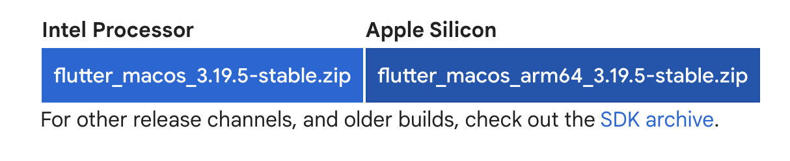
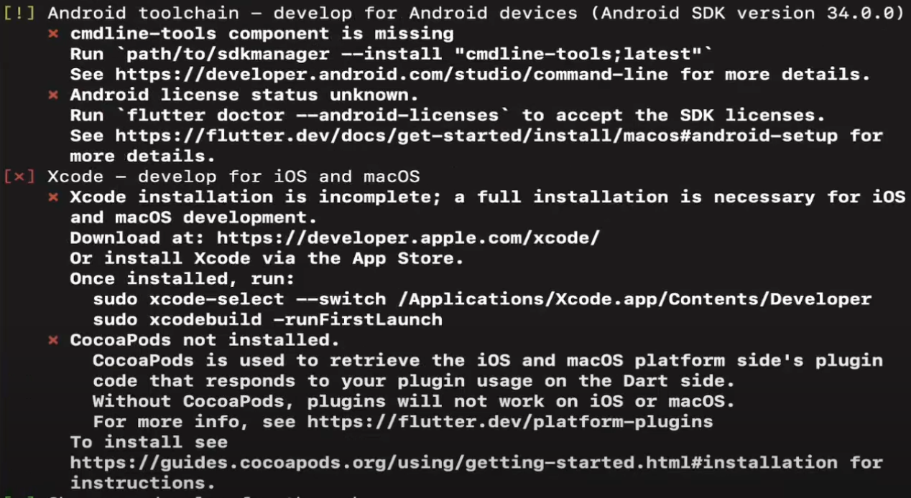
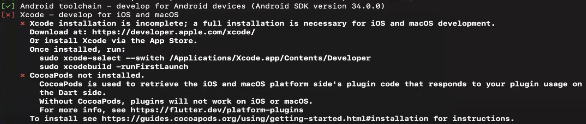
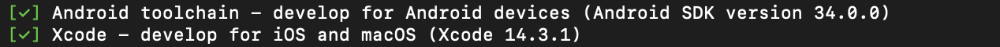

# Todo List Application

## Introdution
This project is a To Do List mobile application developed using Flutter, enabling it to run on both Android and iOS devices. Parts of the project were constructed by following a tutorial by Mitch Koko on YouTube, which can be accessed [here](https://www.youtube.com/watch?v=HQ_ytw58tC4).

The To Do List mobile app aims to provide users with ease of use with a simplistic user interface. It allowing users to...
- [] Add a task by entering a task name (compulsory) and a due date. An error dialog will be displayed if the task name field is left empty
- [] Tasks can be categorized and filtered into "Total," "Remaining," and "Completed" categories using the tab bar
- [] Display number of tasks within each filter
- [] Can mark a task as complete using a checkbox
- [] Can delete a task


## What is Flutter
Before diving into the specifics of the To Do List project, it's important to understand what Flutter is. Flutter uses the Dart programming language. It may be put simply that Flutter is a toolkit for building applications, it offers fundamental components called widgets that can be customize and combine to create a unique user interface.These widgets include elements such as buttons, icons, and text.

To get into deeper explaination of what is Flutter, the [Flutter official website](https://flutter.dev/) says "Flutter is an open-source framework by Google for building beautiful, natively compiled, multi-platform applications from a single codebase.". Natively compiled means that the app is written and compiled specifically for target operating system of a device like Android or iOS, which allowing the application to run more efficiently and with better performance. Multi-platform applications from a single codebase means the developers can build the app once and deploy it on various devices regardless of their operating system, which makes it convient to build a multi-platform application.  Thus, it means that the Flutter framework combines the efficiency of native development with the convenience of cross-platform development.


## Compare Flutter with React
React is a JavaScript library for building user interfaces developed by Facebook. The primary differences to Flutter include:

* Programming Language: React uses JSX, a syntax extension that allow developers to write HTML structures in the same file as JavaScript code to create the UI, whereas the Flutter uses the Dart programming language.
* UI Components: Unlike Flutter that have built-in UI widgets, React constructs the UI using HTML elements and relies on third-party libraries like Material-UI, React Bootstrap, or Ant Design for more complicated components.
* Architecture: React is component-based architecture, means it enabling reusable of UI component. Whereas Flutter is a widget-based architecture that is ideal for crafting aesthetically pleasing cross-platform mobile applications.

Whether to choose React or Flutter for developement depends on the project specifications and target platforms. React is preferable for responsive web application development, whereas Flutter excels in projects aiming for consistent UI and high performance across multiple platforms.

For your interest, if you want to navigate to a React web application to compare React and Flutter, you can have a look into the "react-todo-list" open source project on GitHub created "groundberry" by click [here](https://github.com/groundberry/react-todo-list). The author also uses a date picker did not used third-party library, instead, it is achieved using the native HTML element `<input type="date">`. For other UI elements, the implementation also rely on basic React patterns and HTML elements. 


## Getting Started
Before you can launch the To Do List mobile application, you will need to install below tools...
* Flutter
* Android Studio (to use the Andriod simulator)
* Xcode (to use the iOS simulator)
* An IDE such as Visual Studio Code (not compulsory but an IDE with Flutter extension is recommended)

### Install Flutter
Follow along with the [Flutter](https://docs.flutter.dev/get-started/install) installation website to install Flutter, below also shows a details in how to set it up with **macOS M1**

1. Open terminal and run the following code to install dependencies: 
```
sudo softwareupdate --install-rosetta --agree-to-license
```
2. Install the Flutter SDK
    1. Download the zip file from [Flutter](https://docs.flutter.dev/get-started/install/macos/mobile-ios?tab=download). It should be donwloaded into the `~/Downloads/` directory as default
    
    2. Run the code below in terminal to create a new folder under your home directory and goes into the directory. Flutter has suggested to create a directory at `~/development/`
        ```
        mkdir <path-name>
        cd <path-name>
        ```
    3. Run the code below in terminal to extract the zip file into the created folder
        ```
        unzip ~/Downloads/flutter_macos_arm64_3.19.5-stable.zip
        ```
    4. Add Flutter to your path: Either in the zshrc file for zsh terminal (run `vim .zshrc` to open it) or in the bash_profile file for bash terminal (run `vim .bash_profile` to open it). Add the code below
        ```
        export PATH="$PATH:<path-name>/flutter/bin"
        ```

If you run `flutter doctor` command in terminal, you will see that the status of all the tools. At this stage there should be error for Android Studio and Xcode as shown below. To elimiate the error, we need to install them...


### Install Android Studio
1. Install [Android Studio](https://developer.android.com/studio)
2. Open Android Studio :arrow_right: go to `Plugins` => search "Flutter" => cick `Install` (also install Dart) 
3. Go to `More Actions` => select `SDK Manager` => navigate to `Android SDK` => select `SDK Tools` option => install `Android SDK Command-line tools (latest)`
4. Run `flutter doctor --android-licenses` to accept the licences

If you run `flutter doctor`command again and sees green tick next to Android Studio as shown below then you can move on to install Xcode. If you still encounter error, try to look into the Issues to see if it could help.


> [!NOTE] 
> If you faces an issue with Flutter does not find Android SDK when setting up Android Studio. Try navigating into Android studio => click    `More Actions` => click `SDK Manager` => go into `Android SDK` and copy your Android SDK Location (something like `/Users/name/Library/Android/sdk`) => paste below command into your terminal (remember to replace \<path-to-your-android-sdk-path> to your Android SDK location)
> ```
> flutter config --android-sdk "<path-to-your-android-sdk-path>"
> ```

### Install Xcode
1. Install [Xcode](https://developer.apple.com/xcode/resources/)
2. Open Xcode => select `Settings` => select `location` tab => select version of Xcode in the `Command Line Tools` selector
3. Install cocoapods 
    ```
    sudo gem install cocoapods
    ```
Run `flutter doctor`, if everything shows in green like below, then your're all set!


### Using Visual Studio Code (not needed but recommended)
1. Install [Visual Studio Code](https://code.visualstudio.com/download)
2. Open Visual Studio Code and install Flutter extension: click on `Extensions` tab => search for "Flutter" => click on `install`
> [!TIP]
> For your interest, if you want to create a Flutter project, you can use either the terminal or the command palette of Visual Studio Code...
> * **Terminal:** Run `flutter crate <project-name>` to create a flutter app => your app has been crated!
> * **Command palette of VS Code:** Press `Command + Shift + p` => type "flutter:" => click on `New Project` option => select the `Application` template => choose the location where you want to save your project => give a project name => your app has been created!


## How to launch the To Do List mobile application
After the set up has been completed, follow the steps below to run the To Do List Mobile application on your desired simulator...
1. Clone the project
    ```
    git clone https://github.com/UOA-CS732-SE750-Students-2024/cs732-assignment-swu628.git
    ```
2. Can use either the terminal or the Visual Studio Code to launch the project...
    * **Terminal**
        1. Launch either the iOS simulator `open -a Simulator` or the Andriod simulator (open Android Studio => click on `More Actions` => select `Virtual Device Manager` => then select the device)
        2. Go into the application directory `cd cs732-assignment-swu628`
        3. Run the Flutter app `flutter run`
    * **VS Code**
        1. Open the cloned project
        2. Select emluator: Press `Cmd+Shift+P` on keyboard for macOS or press `Ctrl+Shift+P` for Windows => choose `Flutter: Launch Emulator` => then choose either the iOS or the Andriod emulator
        3. Launch the application by click on `Run` => then click `Run Without Debugging`

After complete the steps above, you should be able to start adding a task!
